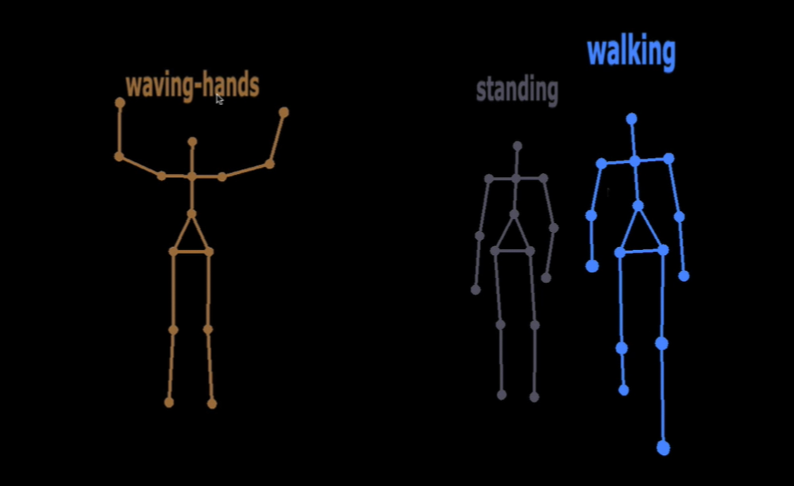
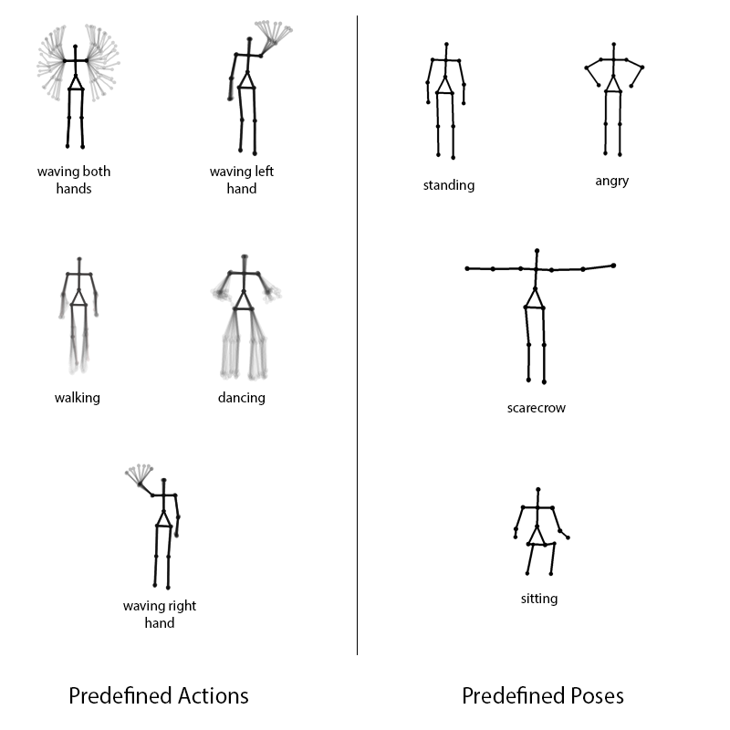

# Activity Recognition

**NOT MAINTAINED - ZigFu Project is not alive**

This is my graduation project that can recognize predefined human poses and actions, working with skeletal data coming from Kinect camera. The main idea is extracting features from displacements of an each joint applying HOG-variant approach. You can read or download the project report from [here](https://drive.google.com/open?id=1hLOigTqTmSn4d2URXfInRLS8PNGE9t8t).

The whole project is built with just javascript and ~~recent~~ web technologies such as node.js, socket.io, WebGL (three.js), neural networks (brain.js).

## Requirements
* Kinect
* Windows or OS X
* Good Web Browser
* NodeJS

## Installation
1. ~~[Download](http://zigfu.com/en/downloads/browserplugin/) and install zigfu installer. If you are on windows and you have Kinect SDK installed, please just install browser plugin only.~~ **Apparently the links are down**
2. `npm install` for installing dependencies.
3. `npm start` for starting server.
4. Plug in kinect and open `http://localhost:3000` in your browser.
5. Don't forget to open the console and play!

## Predefined Poses and Actions
The system has predefined 5 actions and 4 poses now, which can be seen below.

Sure, you can add custom pose or custom data. Since there is no direct interface for adding activity, you have to dig viewer and recorder.
